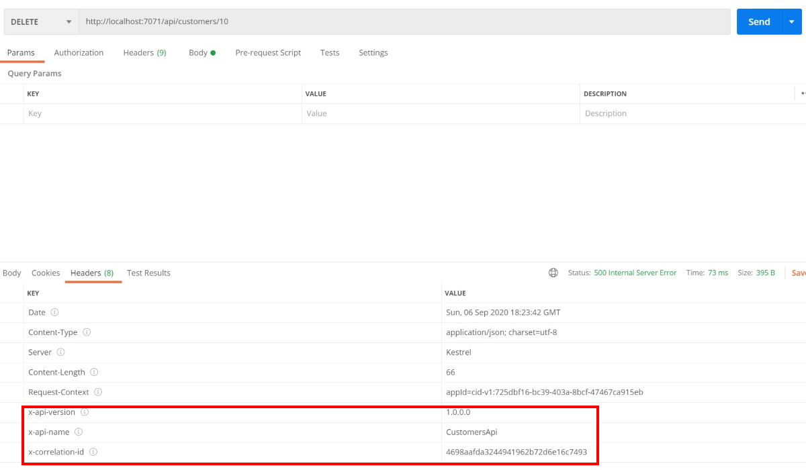
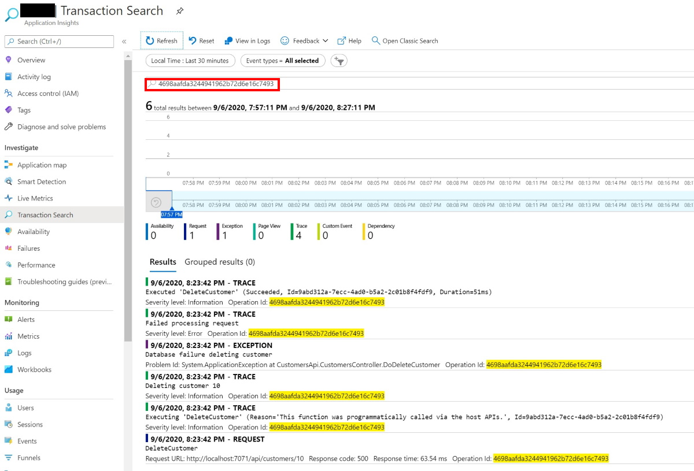
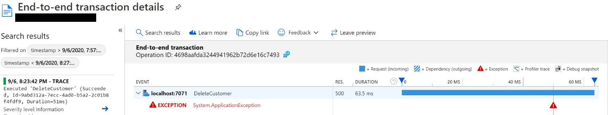
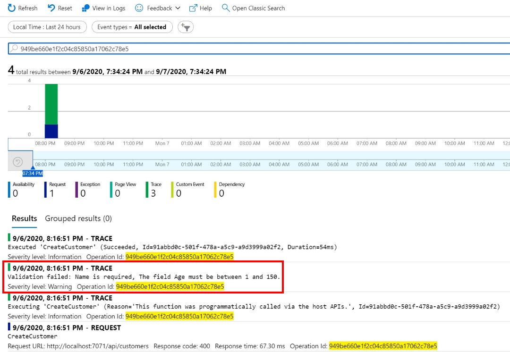
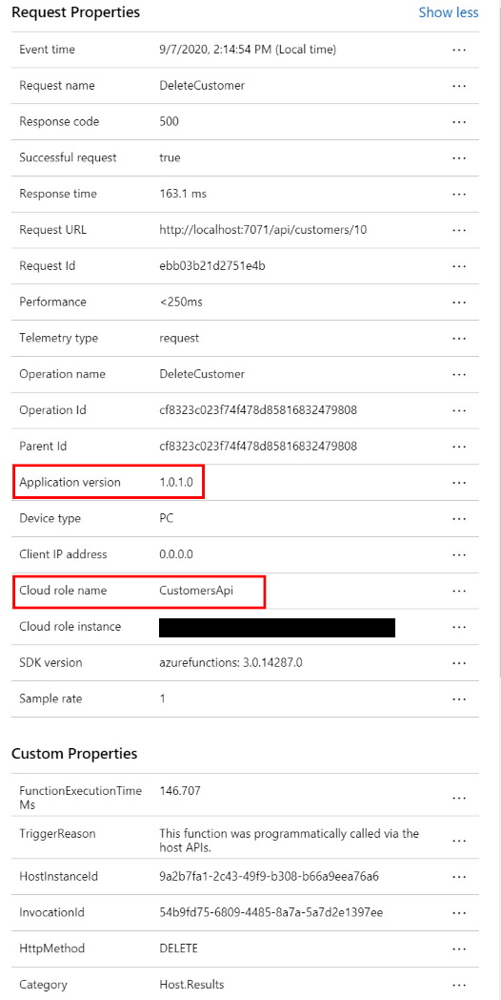
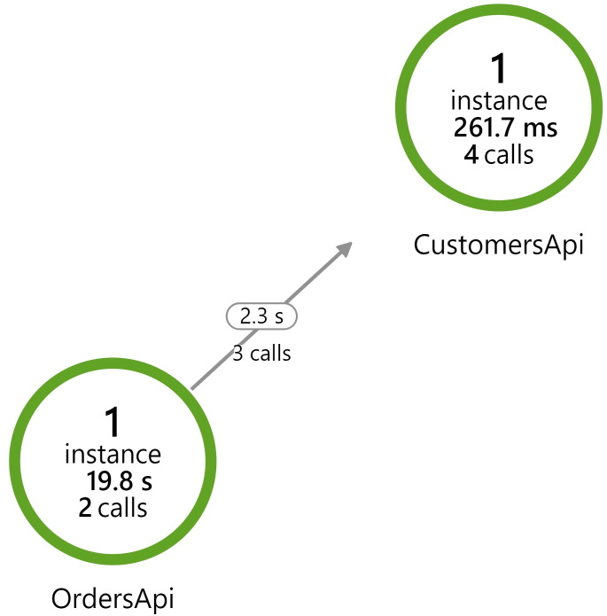

# Quickstarter for web apis on Azure Function

This repository contains a few pre-built functionality that can help you build web apis on top of Azure Functions.

## Error contract and handling

APIs can return errors due to multiple reasons: resource was not found, conflict, unhandled exception, validation failed.
It is a good practice to define a common contract in which those are returned. The details of the contract do not matter, as long as they are consistent.

In this case, most of the work is done in the base class in which http triggered functions should inherit from:

```c#
/// <summary>
/// Returns a <see cref="ApiErrorResponse"/> containing the validation error messages.
/// Status code is <see cref="HttpStatusCode.BadRequest"/>.
/// </summary>
protected IActionResult ValidationFailed(IList<ValidationResult> validationResult) {}

/// <summary>
/// Indicates that the request has failed, returning status code 500.
/// The response body will be of type <see cref="ApiErrorResponse"/>.
/// </summary>
protected IActionResult Failed(string message, Exception ex) {}

/// <summary>
/// Indicates that application failed with an specific <see cref="HttpStatusCode"/>.
/// The response body will be of type <see cref="ApiErrorResponse"/>.
/// </summary>
protected IActionResult Failed(HttpStatusCode statusCode, string errorMessage, string errorCode) {}

/// <summary>
/// Tries to handle the error.
/// </summary>
/// <returns>
/// Returns true if a an response should be returned (where body is of type <see cref="ApiErrorResponse"/>.
/// Returns false if the exception should be bubbled up.
/// </returns>
protected virtual bool TryHandleError(Exception ex, out IActionResult response) {}
```

Error response format:

```json
{
    "errorCode": "error-code",
    "error": "error-message-if-single-error",
    "errors": [ "error-1", "error-2" ]
}
```

Unhandled exceptions in http trigger functions will return an empty body with status code 500. In order to return a proper response we need to wrap the function body code in a try..catch block.

There are two options:

1. Do the try..catch manually in the function body
1. Use the base class Run/RunAsync wrapper that contain the try..catch inside

```c#
[FunctionName(nameof(GetCustomer))]
public IActionResult GetCustomer(
    [HttpTrigger(AuthorizationLevel.Function, "get", Route = "customers/{id}")] HttpRequest req,
    int id)
{
    IActionResult DoGetCustomer()
    {
        if (id <= 0)
        {
            return ValidationFailed("Id must be positive");
        }

        // Simulate does not exist
        if (id == 100)
        {
            return NotFound();
        }

        return OK(new CustomerDto
        {
            Id = id,
        });
    }

    return Run(DoGetCustomer);
}
```

## Correlation and metadata in response

As the API starts to be used by other people we need a way to monitor it. An important point is enabling us to find instrumentation for a given request. This quickstarter contains a possible implementation that integrates with Application Insights. It works the following way:

1. In the function settings (local.settings.json for local development) set the APPINSIGHTS_INSTRUMENTATIONKEY key to contain the Application Insights instrumentation key
1. Enable response enrichment by registering an IFunctionInvocationFilter which will include in the response header metadata information. That happens in src/CustomersApi/Startup.cs (`builder.Services.AddApiResponseHeaders<Startup>()`).
1. Set the correct log level on the application and infrastruture level (see src/CustomersApi/host.json)

Example of a response header:


Using the correlation-id to search logs in Application Insights:


End to end tracing in Application insights:


The fact that we are logging validation results can also be handy in scenarios where an API user reports problems using it, providing a correlation-id. With this information we can locate the actual validation error:



## Application Insights enrichment

Application Insights instrumentation can be argumented to include additional information. In this repo we are adding the cloud role and the application version by registering a ITelemetryIntializer. That happens in src/CustomersApi/Startup.cs (`builder.Services.AddApiTelemetryMetadata()`).

Argumented instrumentation:


With this information the Application Map of Application Insights is more readable:


## Running the demo project

Easiest way to get started is to run both APIs from Visual Studio:

1. Set application insights in both Azure Functions (see example local.settings.json)
1. Right click on the solution then Properties
1. Common Properties / Startup Project
1. Select Multiple startup projects
   1. Select CustomersApi with Start action
   1. Select OrdersApi with Start action

### Local.settings.json example

```json
{
  "IsEncrypted": false,
  "Values": {
    "AzureWebJobsStorage": "UseDevelopmentStorage=true",
    "FUNCTIONS_WORKER_RUNTIME": "dotnet",
    "APPINSIGHTS_INSTRUMENTATIONKEY": "<application-insights-key>"
  }
}
```

## What's next?

- API discoverability with OpenAPI: using [Azure API Management](https://docs.microsoft.com/azure/azure-functions/functions-openapi-definition) or using [AlienCube](https://github.com/aliencube/AzureFunctions.Extensions).